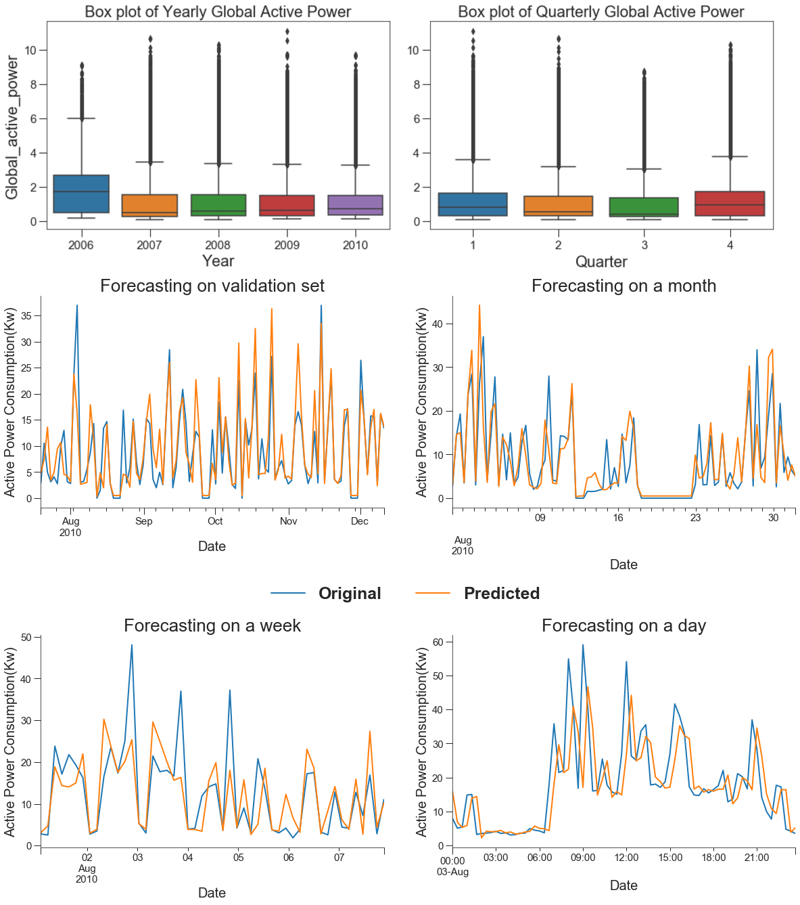

# Time Series forecasting of power consumption

## Goal and Description  

The data is the measurements of electric power consumption in one household with a one-minute sampling rate over a period of almost 4 years. 

The **raw data** can be downloaded from **[here](https://www.kaggle.com/uciml/electric-power-consumption-data-set/data)**

Different electrical quantities and some sub-metering values are available. The aim of this notebook to perform the **Timeseries forecasting and predictive analysis** on `Global_active_power variable`, which represent the total power consumption. 

In technical terms, this is a regession problem. `Global_active_power variable` is the only feature that we are interested in. Timeseries forecasting of the `Global_active_power variable` can be performed by reformulating the problem into a supervised learning problem. For example, using first **1-29** values of `Global_active_power variable` as features **(X)** to predict **30th** value (i.e. target **(y)**).

##### Jupyter notebook `TimeseriesEDA-forecasting-model-comparision.ipynb` contains

* Exploratory Data analysis (EDA) of timeseries fluctuations of  `Global_active_power variable` in various timeperiods.
* Statistical test to check normality of the data.
* Statistical test to check whether timeseries is stationary.
* Timeseries forecasting of `Global_active_power variable` with Recurrent Neural Networks (LSTM,GRU models) (see picture below).   

Model specification are : 

  
|     Method    |   Numbers
| ------------- | ------------- |
|  RNN(LSTM, GRU)    | 2  layers |
| Droput Value  | 0.5       |
| Bidirectional | No  |
| Optimizer     | adam    |
| Class reweighing | No    |
| Undersampling | No |
| Sequence Length | 30 |
| Nodes | 128|
|Batch size | 64 |
|Learning Rate | 0.001 |
|RMSE (LSTM) | 2.37 |
|RMSE (GRU) | 2.34 |

